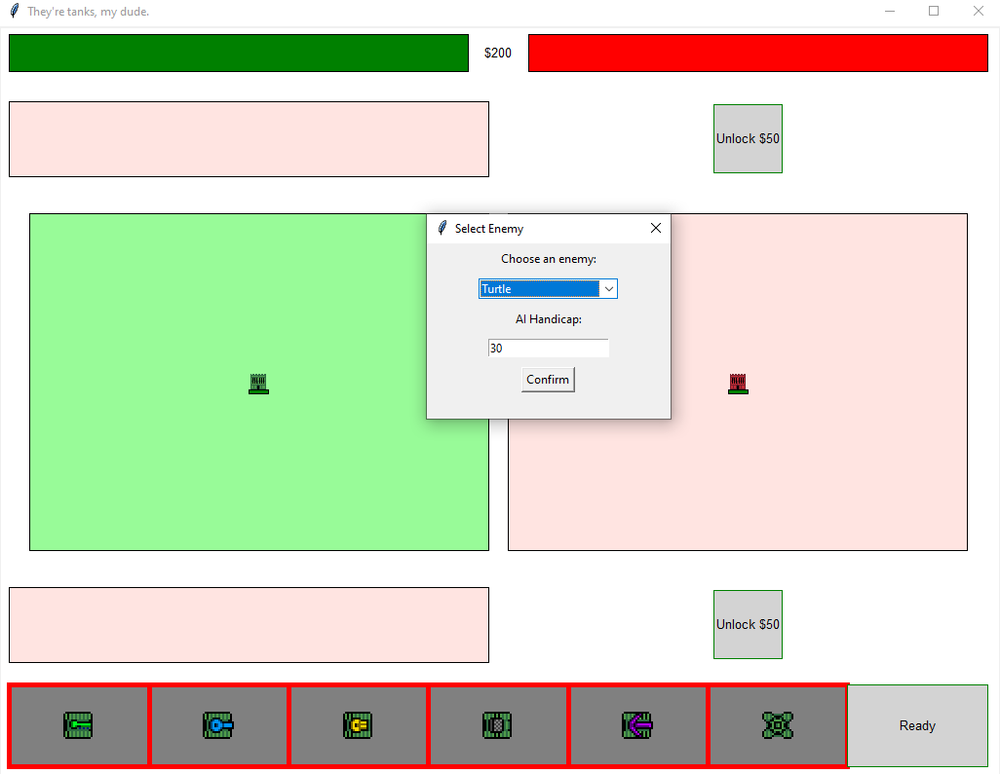

# tankbattles
Tank Battler

This is basically a featureless MechaBellum clone. Right now, you can buy/place tanks and unlock the flanks. You can't upgrade units, and there are no special effects to buy (like missiles or napalm, etc).

The balance is about where I want it to be. If both sides use just one kind of tank, there are determinate winners and losers. But no single-type troop comp is better than a variety of troop-types. There are a lot of strategy options with what little we have. 

If you want to win ***every single time*** against the bot, just put a few cannons next to your castle on the first round, and then spend every other round putting chainguns in the far corner behind the bot base (obvs this won't work against humans). If you start to lose, put a few more canons next to your base to slow them down. You can win the base race.

Multiplayer works now. It's not perfect, but playable for sure, and now the client troop movements are better sync'd up with the server, so you can actually make informed decisions about how to win. Unit death, win conditions, and the seed for random bullet spread is handled at the server side. The client sets unit targets and moves them around, and triggers its own shots.

For devs: it's set up so that it would be pretty easy to add more tanks. Just modify the sprite sheet and the unit dictionary. Instructions are in the unit class file.

To play the game, put all the files in one folder and run Batfield.py. If you just want to watch tanks fight, bfield_idle_demo.py is for that, but it is running like my first draft of the unit class, so the behavior won't be the same as the game units.... maybe I'll polish it a little later.

To do:
- client/server fine-tuning
- fix the unit mousehover so it doesn't have an extra newline
- improve the AI for the PC opponent (right now it just randomly places tanks)
- add some more tanks
- add battlefield oneshot effects (like napalm, shields, etc)
