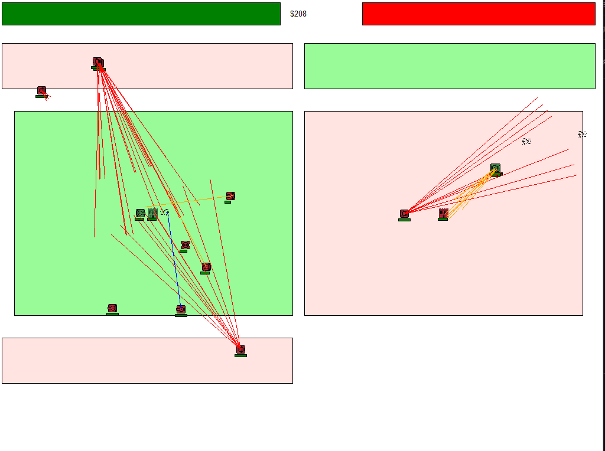
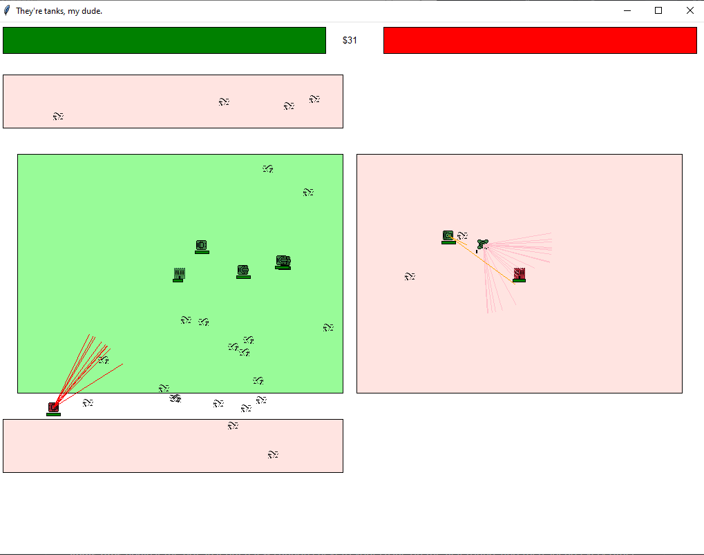
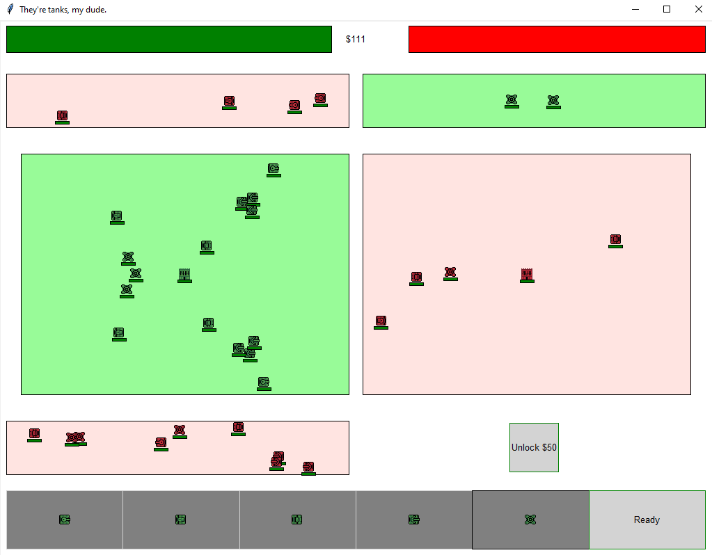

# tankbattles
Tank Battler

This is basically a featureless MechaBellum clone. Right now, you can buy/place tanks and unlock the flanks. You can't upgrade units, and there are no special effects to buy (like missiles or napalm, etc).

It's not balanced very well yet, but there are a lot of strategy options with what little we have. If you want to win ***every single time*** against the bot, just put a few cannons next to your castle on the first round, and then spend every other round putting chainguns in the far corner behind the bot base. If you start to lose, put a few more canons next to your base to slow them down. You can win the base race.

Multiplayer works now, but the client-side has some QOL and visual issues. For example, if there are a lot of units on the screen, the client will see them move faster than they're supposed to (or maybe they're moving at normal speed, and the host is just slow because it's busy processing everything), and their motion will be jerky. Unit target setting, shooting, death, and win conditions are all handled at the server side. The client just does its own graphics, and moves the units toward their targets.

For devs: it's set up so that it would be pretty easy to add more tanks. Just modify the sprite sheet and the unit dictionary. Instructions are in the unit class file.

To play the game, put all the files in one folder and run Batfield.py. If you just want to watch tanks fight, bfield_idle_demo.py is for that.

To do:
- client performance improvements
- fix the unit mousehover so it doesn't have an extra newline
- improve the AI for the PC opponent (right now it just randomly places tanks)
- add some more tanks
- add battlefield oneshot effects (like napalm, shields, etc)
